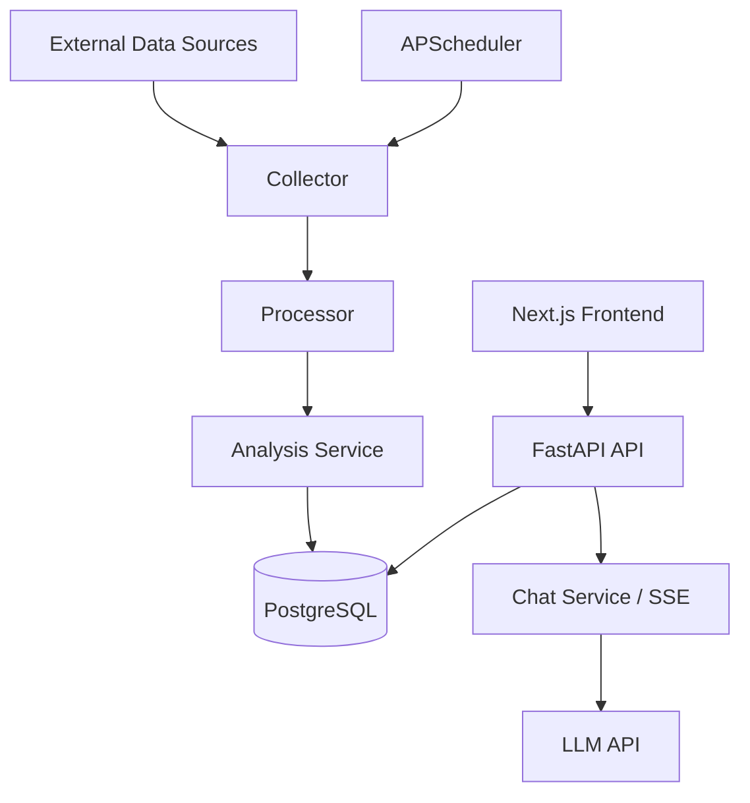

# Decypher AI


Decypher AI is an AI-powered intelligence platform for tracking technology signals, analyzing market opportunities, and turning fragmented public data into structured decision support. The system continuously collects information from more than 15 sources, filters and summarizes it with LLMs, and presents actionable opportunity cards through a web dashboard and AI analyst interface.

## Overview

This project combines:

- multi-source signal collection from GitHub, Hacker News, arXiv, Product Hunt, Stack Exchange, SEC, RSS feeds, and more
- asynchronous backend orchestration with FastAPI and APScheduler
- AI-powered analysis and report generation using OpenAI-compatible LLM APIs
- a Next.js dashboard for task management, opportunity discovery, notes, and chat
- PostgreSQL for structured data storage and Redis for scheduling metadata

## Core Features

- Daily or interval-based intelligence tasks
- Multi-source scraping and normalization pipeline
- AI analysis for opportunity scoring and summarization
- Task management and execution triggers
- Dashboard for curated opportunity cards
- Chat interface with realtime AI analyst responses via SSE
- User authentication and notes system

## System Architecture



## Tech Stack

### Backend
- Python 3.11+
- FastAPI
- SQLAlchemy 2.0 + asyncpg
- PostgreSQL
- Redis
- APScheduler
- Pydantic + Pydantic Settings
- OpenAI-compatible LLM integration

### Frontend
- Next.js 14
- React 18
- TypeScript
- Tailwind CSS
- Zustand
- Axios

### Infrastructure
- Docker Compose
- PostgreSQL 15
- Redis 7

## Project Structure

```text
.
├── backend/
│   ├── app/
│   │   ├── api/
│   │   ├── core/
│   │   ├── integrations/
│   │   ├── models/
│   │   ├── schemas/
│   │   ├── services/
│   │   ├── workers/
│   │   ├── config.py
│   │   └── database.py
│   ├── tests/
│   ├── main.py
│   ├── requirements.txt
│   └── pytest.ini
├── frontend/
│   ├── src/
│   ├── package.json
│   └── next.config.js
├── docs/
├── docker-compose.yml
├── .env.example
├── README.md
├── CLAUDE.md
└── scratch_convert.py
```

## Getting Started

### Prerequisites

- Python 3.11+
- Node.js 20+
- Docker Desktop

### 1. Configure environment

Create a `.env` file in the project root by copying `.env.example` and filling in your values.

```bash
copy .env.example .env
```

### 2. Start infrastructure services

```bash
docker compose up -d
```

This starts:
- PostgreSQL on port 5432
- Redis on port 6379

### 3. Start the backend

```bash
cd backend
python -m venv .venv
.venv\Scripts\Activate.ps1
pip install -r requirements.txt
uvicorn main:app --reload --host 0.0.0.0 --port 8000
```

Verify the service:

```bash
http://localhost:8000/health
```

Expected response:

```json
{"status": "healthy", "service": "Decypher AI Backend", "version": "0.1.0"}
```

### 4. Start the frontend

```bash
cd frontend
npm install
npm run dev
```

Open:

```bash
http://localhost:3000
```

## Default Data Flow

1. A task is created with keywords and selected sources.
2. The collector gathers data from the relevant integrations.
3. The processor normalizes and deduplicates the raw signals.
4. The analysis service uses LLMs to produce structured opportunity records.
5. The frontend loads the results and exposes them through the dashboard and chat experience.

## Documentation

The repository includes deeper design and product docs in the `docs/` folder, including:

- product positioning
- architecture details
- roadmap and implementation status
- database overview and schema planning
- API conventions and integration references

## Notes

This project is intended as a full-stack AI intelligence platform prototype and is structured for iterative product development. It is already functional for local development and can be extended with additional source integrations, better retrieval, and more advanced AI orchestration.
