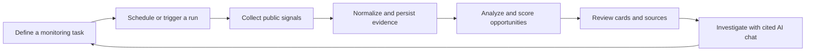
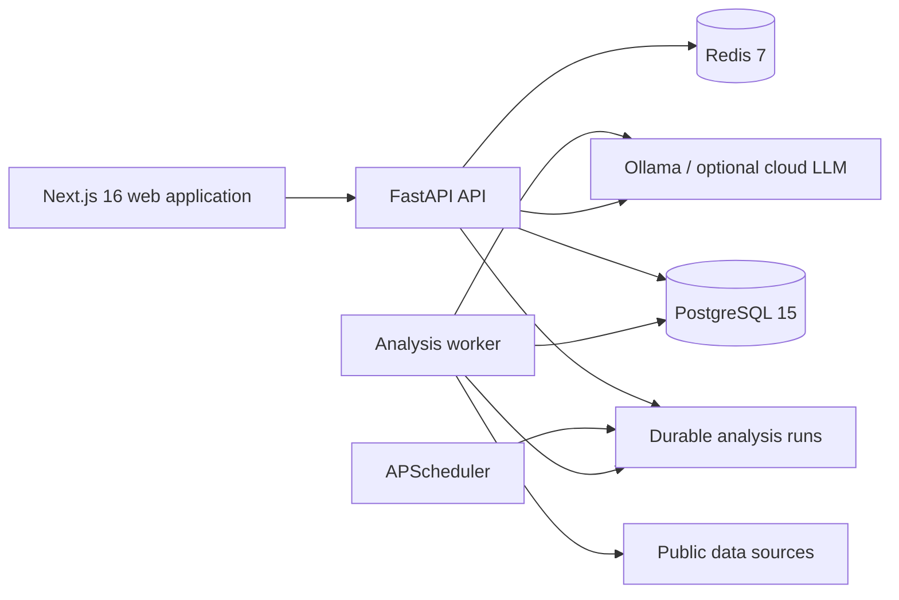

# Decypher AI

> Turn fragmented technology signals into traceable, actionable opportunities.

Decypher AI is a self-hosted intelligence workspace for founders, product teams, researchers, and technology strategists. It continuously monitors selected public sources, preserves the underlying evidence, and uses AI to transform raw signals into structured opportunity cards and source-grounded conversations.

Instead of moving between feeds, spreadsheets, bookmarks, and generic chat tools, teams can run the complete research loop in one place: define what matters, collect relevant evidence, evaluate opportunities, inspect the sources, and continue the analysis with an AI assistant.

The current release is a functional local-first MVP. PostgreSQL, Redis, and Ollama form the default stack, so the core workflow can run without sending research data to a hosted language model.

## Why Decypher AI

Technology intelligence is rarely limited by a lack of information. The harder problem is turning a large volume of disconnected signals into decisions that are timely, explainable, and repeatable.

Decypher AI addresses four recurring gaps:

- **Signal fragmentation** — technical discussions, research papers, product launches, repositories, and market indicators live across unrelated platforms.
- **Manual synthesis** — collecting, deduplicating, scoring, and summarizing evidence is slow and difficult to repeat consistently.
- **Weak traceability** — AI-generated conclusions are difficult to trust when the underlying sources are missing or disconnected from the result.
- **Data-control constraints** — sensitive research workflows may not be suitable for a mandatory hosted-model dependency.

## Product advantages

| Advantage | What it provides |
| --- | --- |
| Evidence-first intelligence | Every analysis starts from persisted source items rather than an isolated prompt. Users can inspect the material behind an opportunity. |
| End-to-end research loop | Monitoring, collection, analysis, review, and follow-up conversation share one durable workspace. |
| Local-first AI | Ollama is the default provider, enabling private local inference without a hosted AI key. OpenAI-compatible providers remain optional. |
| Durable and auditable execution | Analysis runs, source items, results, conversations, and failures are stored in PostgreSQL instead of being tied to a browser session. |
| Decision-oriented output | Signals are converted into categorized opportunity cards with five-dimensional scoring, summaries, evidence, risks, and recommended actions. |
| Extensible source layer | Provider-specific adapters normalize different public sources into a common analysis pipeline. |

## Core capabilities

### Intelligence monitoring

- Create monitoring tasks around a topic, category, keyword set, source set, schedule, and result limit.
- Run a task on demand or allow the scheduler to enqueue recurring analysis.
- Follow each run through queued, running, completed, or failed states.
- Review historical runs without losing prior results.

### Multi-source collection

- Collect source material concurrently through modular integrations.
- Normalize and deduplicate heterogeneous records before analysis.
- Preserve titles, URLs, descriptions, metrics, timestamps, and raw provider data for later inspection.
- Use adapters for GitHub, Hacker News, DEV Community, arXiv, OpenAlex, Semantic Scholar, Papers with Code, Product Hunt, SEC EDGAR, Stack Exchange, Remote OK, and RSS. Credentials are required by some providers.

### AI opportunity analysis

- Generate structured opportunity cards from collected evidence.
- Classify findings by opportunity category.
- Score opportunities across multiple decision dimensions.
- Surface supporting evidence, potential risks, and concrete next actions.
- Choose local Ollama or an optional OpenAI-compatible provider through configuration.

### Research workspace

- Explore opportunities from a focused dashboard.
- Filter, favorite, and annotate findings.
- Inspect the source records connected to a task and analysis run.
- Keep monitoring configuration, evidence, and conclusions together.

### Source-grounded AI analyst

- Continue investigating a topic through streaming chat.
- Retrieve relevant records only from the authenticated user's stored task data.
- Return citations with responses so claims can be checked against the collected evidence.
- Persist conversations and messages across sessions.

## How it works



Long-running work is separated from HTTP requests. The API and scheduler enqueue durable `analysis_runs`; a worker safely claims queued work, collects and stores source `items`, invokes the selected language model, and records the final state. This design makes interrupted and failed work visible and keeps analysis history reproducible.

## Typical use cases

- **Founders and venture builders** monitoring unmet needs, emerging tools, and adoption signals before selecting an opportunity.
- **Product teams** tracking ecosystem movement, developer pain points, competitive shifts, and adjacent product ideas.
- **Research teams** consolidating papers, repositories, and technical discussion into an evidence-backed briefing workspace.
- **Technology strategists** maintaining recurring scans of a market, capability, or industry theme with a reviewable history.

## System architecture



### Technology stack

- **Frontend:** Next.js 16, React 19, TypeScript 5, Tailwind CSS, Zustand
- **Backend:** Python 3.12, FastAPI, SQLAlchemy 2, asyncpg, Pydantic 2
- **Data:** PostgreSQL 15, Redis 7, Alembic
- **AI:** Ollama native Chat API by default; OpenAI-compatible providers are optional
- **Quality:** pytest, ESLint 9, TypeScript checks, production builds, Docker, GitHub Actions

## Quick start

### Prerequisites

- Python 3.12
- Node.js 20.9 or newer
- Docker Desktop with Docker Compose
- Ollama

### 1. Configure and start infrastructure

```bash
cp .env.example .env
docker compose up -d postgres redis
```

Replace `DECYPHER_SECRET_KEY` before using the application outside local development:

```bash
python -c "import secrets; print(secrets.token_hex(32))"
```

### 2. Start local AI

On macOS:

```bash
brew install ollama
brew services start ollama
ollama pull qwen3.5:9b
```

### 3. Start the backend and worker

```bash
cd backend
python3.12 -m venv .venv
source .venv/bin/activate
pip install -r requirements.txt
alembic upgrade head
uvicorn main:app --reload --host 127.0.0.1 --port 8000
```

In a second terminal:

```bash
cd backend
source .venv/bin/activate
python -m app.workers.runner
```

### 4. Start the frontend

```bash
cd frontend
npm ci
npm run dev
```

Open `http://localhost:3000`. Interactive API documentation is available at `http://localhost:8000/api/docs`.

To build and run the application services in Docker instead, use the `app` profile:

```bash
DECYPHER_SECRET_KEY="$(python -c 'import secrets; print(secrets.token_hex(32))')" \
docker compose --profile app up --build
```

## Project structure

```text
backend/
  alembic/                  versioned database migrations
  app/api/v1/               authenticated HTTP and SSE endpoints
  app/integrations/         public-source adapters
  app/models/               durable domain and conversation models
  app/services/             analysis, retrieval, and LLM services
  app/workers/              collection and analysis workers
  tests/                    backend API and pipeline tests
frontend/
  src/app/                  Next.js App Router pages
  src/components/           dashboard, task, and chat interfaces
  src/hooks/                application data hooks
  src/lib/api.ts            typed API client
docs/                       product, architecture, API, and data documentation
.github/workflows/ci.yml    backend and frontend continuous integration
docker-compose.yml          local infrastructure and application profile
```

## Quality and verification

```bash
# Backend
cd backend
source .venv/bin/activate
pytest -q
alembic check

# Frontend
cd frontend
npm run lint
npm run type-check
npm run build
npm audit --audit-level=high

# Infrastructure
docker compose config --quiet
```

The repository includes health and readiness endpoints at `/health` and `/health/ready`. CI runs backend tests and frontend linting, type checks, and production builds for pushes and pull requests.

## Current scope

Decypher AI is an active development project, not a production-hosted service.

- Retrieval currently uses lexical relevance and signal scoring; embeddings and pgvector are planned.
- Reddit collection is an explicit stub and is not considered operational.
- Notifications, subscriptions, generated reports, and file upload remain future product work.
- GitHub and Hacker News have completed browser-driven acceptance testing in the current development environment; the remaining adapters require provider-specific acceptance tests.
- Production deployment, load testing, observability, and backup procedures remain to be completed.

See the [implementation status](docs/status.md), [product definition](docs/product.md), [architecture](docs/architecture.md), and [roadmap](docs/roadmap.md) for further detail.

## License

No license has been declared. All rights are reserved by the repository owner unless a license is added later.
